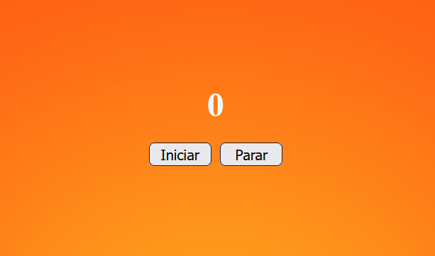

<h1 align="center"> Cronômetro! </h1>

Cada segundo conta.

  <a href="#-tecnologias">Tecnologias</a>&nbsp;&nbsp;&nbsp;|&nbsp;&nbsp;&nbsp;
  <a href="#-projeto">Projeto</a>&nbsp;&nbsp;&nbsp;|&nbsp;&nbsp;&nbsp;
  

  

 

  

## 🚀 Tecnologias

Esse projeto foi desenvolvido com as seguintes tecnologias:

- HTML e CSS
- javascript
- Git e Github

## 💻 Projeto

Este projeto é um cronômetro simples e funcional, desenvolvido para ajudar a medir o tempo com precisão.

## 🔖 Licença

Esse projeto está sob a licença MIT....